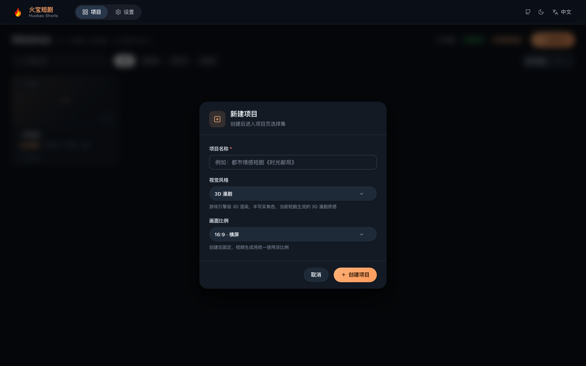
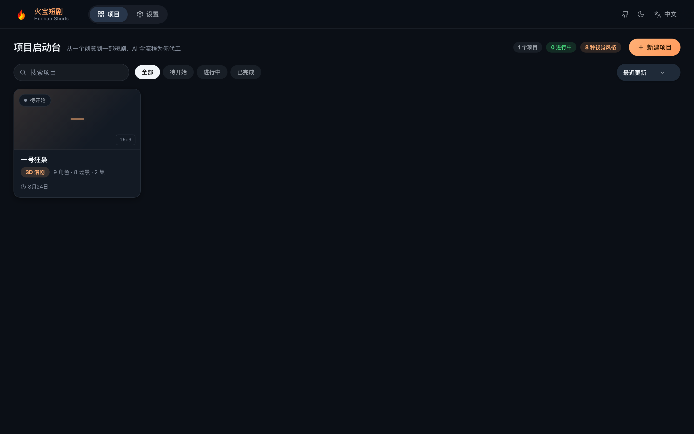
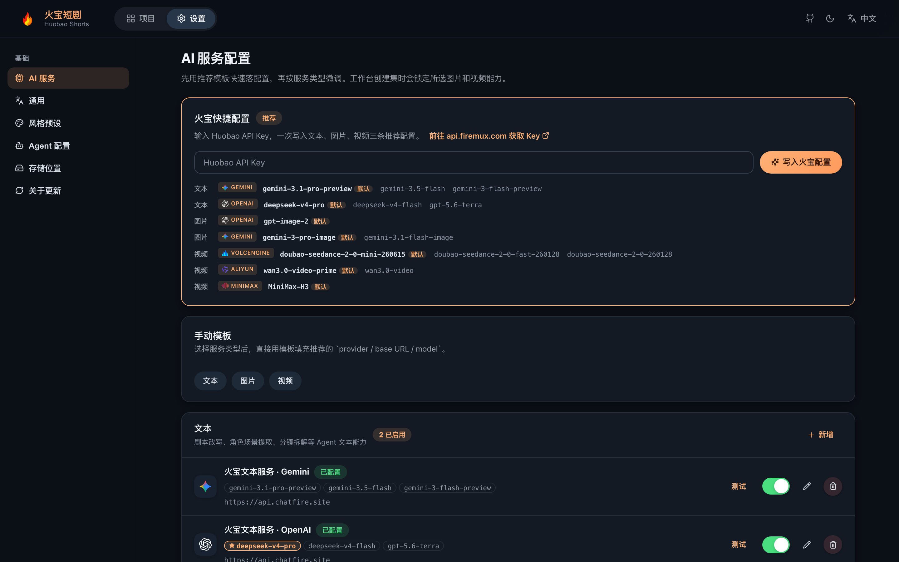
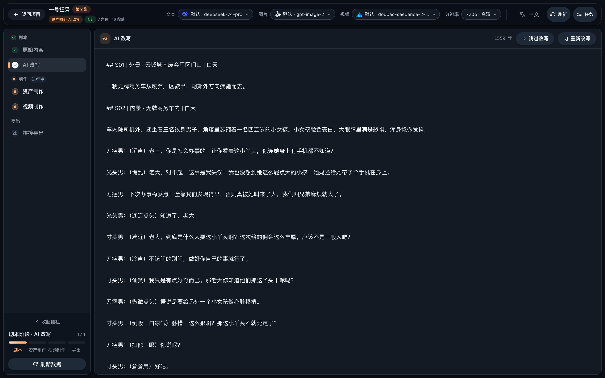
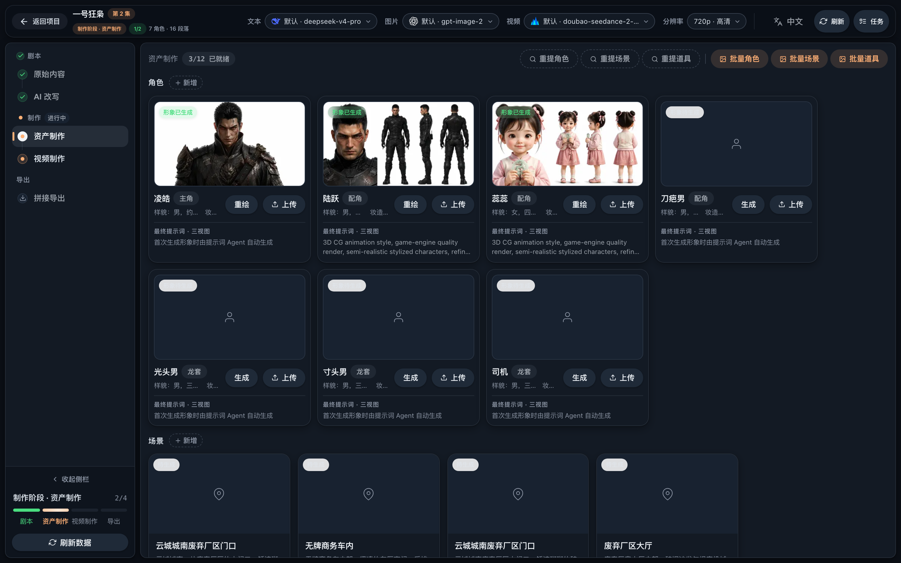
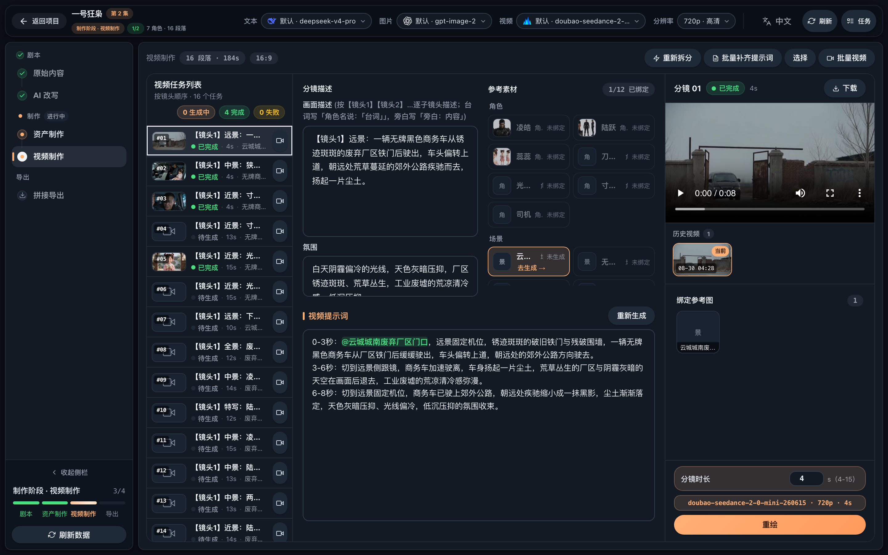
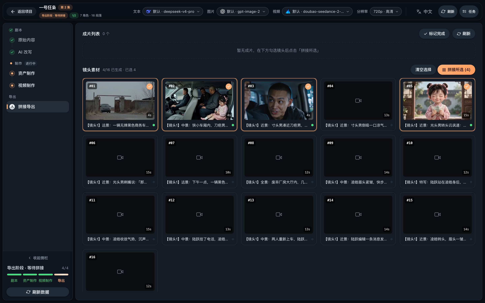
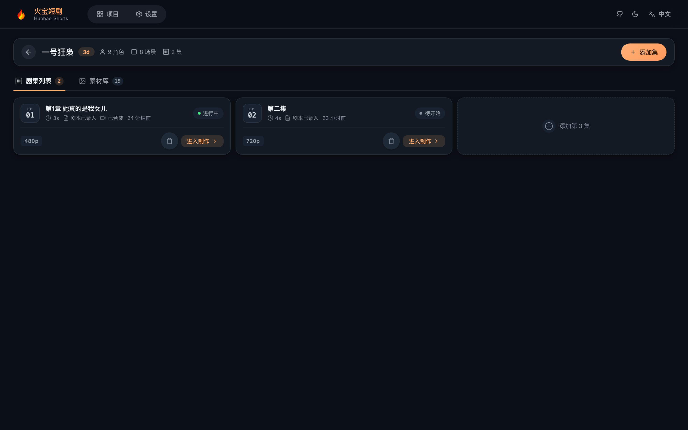

# 🎬 Huobao Drama - AI ショートドラマ生成プラットフォーム

<div align="center">

**TypeScript フルスタックの AI ショートドラマ自動制作プラットフォーム**

[](https://nodejs.org)
[](https://vuejs.org)
[](https://creativecommons.org/licenses/by-nc-sa/4.0/)
[](https://github.com/chatfire-AI/huobao-drama/releases/latest)

[English](README.md) | [简体中文](README.zh-CN.md) | **日本語** | [한국어](README.ko.md)

[機能](#-機能) • [クイックスタート](#-クイックスタート) • [チュートリアル](#-チュートリアル画像付き) • [デスクトップ版](#-デスクトップアプリ推奨) • [デプロイ](#-デプロイ)

<h2>🔑 <a href="https://api.firemux.com">Huobao API Key を取得 👉 今すぐ見る</a></h2>

**テキスト・画像・動画のすべての AI 機能を、1 つの Key で有効化**

デプロイ後、「設定 → 火宝クイック設定」に Key を貼るだけで、3 つの推奨設定をワンクリックで書き込み

<h3>📥 <a href="https://github.com/chatfire-AI/huobao-drama/releases/latest">デスクトップ版をダウンロード（macOS / Windows）</a></h3>
<h3>🌐 <a href="https://www.chatfire.site">公式サイト</a></h3>

</div>

---

## 📖 プロジェクト概要

Huobao Drama は AI ベースのショートドラマ自動制作プラットフォームです。脚本生成、キャラクターデザイン、分镜制作から動画合成まで、全工程を自動化します。

### 🎯 コアバリュー

- **🤖 AI 駆動**：大規模言語モデルで脚本を解析し、キャラクター・シーン・分镜情報を抽出
- **🎨 インテリジェント制作**：AI 画像生成でキャラクター形象とシーン背景を作成
- **📹 動画生成**：テキスト→動画・画像→動画モデルで分镜動画を自動生成
- **🔄 ワークフロー**：アイデアから完成作品までのショートドラマ制作をワンストップで完結

### 🛠️ 技術アーキテクチャ

```
frontend/   — Nuxt 3 + Vue 3 + TypeScript (純粋 CSS、UI フレームワークなし)
backend/    — Hono + Drizzle ORM + Mastra AI Agents + better-sqlite3
backend/workspace/skills/ — Agent スキル定義 (SKILL.md、UI からオンライン編集可能)
desktop/    — Electron デスクトップ版（メインプロセス + esbuild バンドル + electron-builder で dmg/exe）
data/       — 生成アセットと SQLite データベース
```

---

## ✨ 機能

### 🎭 キャラクター管理

- ✅ AI によるキャラクター形象生成
- ✅ キャラクターの一括生成
- ✅ キャラクター画像のアップロードと管理

### 🎬 動画タスク

- ✅ AI による動画タスクの自動生成
- ✅ シーン説明と動画プロンプトの生成
- ✅ タスク単位の一括動画生成

### 🎥 動画生成

- ✅ テキスト→動画の自動生成
- ✅ FFmpeg によるショット単位の合成と字幕処理
- ✅ エピソード全体の結合と書き出し

### 📦 アセット管理

- ✅ 素材ライブラリの一元管理
- ✅ ローカルストレージ対応
- ✅ タスク進捗トラッキング

### 🤖 AI Agents

4 つの Mastra Agent を内蔵。データベース設定と Skill 拡張に対応：

| Agent | 役割 |
|---|---|
| `script_rewriter` | 小説 → フォーマット済み脚本へのリライト |
| `extractor` | キャラクター / シーン / 小道具のインテリジェント抽出と重複排除 |
| `storyboard_breaker` | 脚本 → 分镜シーケンスへの分解 |
| `prompt_generator` | キャラクター/シーン/小道具の画像プロンプト + 分镜動画プロンプト生成 |

### 🌐 多言語 UI

インターフェースは **中文 / English / 日本語 / 한국어** を内蔵し、AI 生成コンテンツの言語をグローバルに設定できます。

### 🔌 マルチプロバイダー対応

| タイプ | 対応プロバイダー |
|---|---|
| **テキスト** | OpenAI（互換 API）、Gemini |
| **画像** | OpenAI、Gemini、Volcano Engine |
| **動画** | Volcano Engine Seedance 2.0（Standard / Fast / Mini）、MiniMax H3、Alibaba Bailian Wan 3.0（Prime / Standard） |

---

## 🚀 クイックスタート

### 📋 動作環境

| ソフトウェア | バージョン | 説明 |
|---|---|---|
| **Node.js** | 20+ | フロントエンド・バックエンド実行環境 |
| **npm** | 9+ | パッケージマネージャー |

> **データベース不要**：SQLite 内蔵（プロジェクトのデータディレクトリに単一ファイル）。データベースサーバーのインストールは不要です。
> **FFmpeg 不要**：`ffmpeg-static` / `ffprobe-static` npm パッケージにバイナリを内蔵。すぐに使えます。

### ⚙️ 環境変数

設定ファイルは不要。環境変数で設定します（すべてデフォルト値あり、ローカル開発はゼロ設定で起動可能）：

| 変数 | デフォルト値 | 説明 |
|---|---|---|
| `SQLITE_PATH` | `<リポジトリ>/data/huobao.sqlite3` | SQLite データベースファイルの場所 |
| `PORT` | `5679` | バックエンドサービスのポート |
| `STORAGE_PATH` | `<リポジトリ>/data/static` | 生成ファイルの保存ディレクトリ |
| `HUOBAO_DATA_DIR` | — | デスクトップ版で Electron メインプロセスが注入（userData データルート） |
| `WORKSPACE_PATH` | `backend/workspace` | Agent スキル/プロンプトディレクトリ（デスクトップ版は userData の書き込み可能なコピー） |
| `FRONTEND_DIST` | `frontend/dist` | フロントエンド静的ビルドディレクトリ |
| `FFMPEG_BIN` / `FFPROBE_BIN` | npm 内蔵バイナリ | カスタム ffmpeg/ffprobe の実行ファイルパス |
| `PUBLIC_BASE_URL` | — | Seedance がローカル参照リソースを使う際に必要な公開 URL（サーバーデプロイ用） |

> **説明**：AI サービスの API Key、Base URL、モデルパラメータはすべて Web UI の「設定」ページで設定してデータベースに保存します。設定ファイルや環境変数では管理しません。

### 📥 インストール

```bash
# リポジトリをクローン
git clone https://github.com/chatfire-AI/huobao-drama.git
cd huobao-drama

# バックエンドの依存をインストール
cd backend && npm install

# フロントエンドの依存をインストール
cd ../frontend && npm install
```

### 🎯 起動

#### 方法 1：開発モード（推奨）

フロントエンドとバックエンドを分離し、ホットリロード対応：

```bash
# ターミナル 1：バックエンド
cd backend
npm run dev

# ターミナル 2：フロントエンド
cd frontend
npm run dev
```

- フロントエンド：`http://localhost:3013`
- バックエンド API：`http://localhost:5679/api/v1`
- フロントエンドは `/api` と `/static` をバックエンドへ自動プロキシ

#### 方法 2：シングルサービスモード

バックエンドが API とフロントエンド静的ファイルの両方を提供：

```bash
# 1. フロントエンドをビルド
cd frontend && npm run generate

# 2. ビルド成果物をバックエンドが読むディレクトリへコピー
#    （generate の出力は .output/public、バックエンドは frontend/dist を読む）
cp -r .output/public dist

# 3. バックエンドを起動
cd ../backend && npm start
```

アクセス：`http://localhost:5679`

### 🗄️ データベース

SQLite 内蔵（`better-sqlite3` + WAL モード）。初回起動時にテーブルを自動作成（冪等な DDL リプレイ + シードデータ）。デフォルトのファイルは `data/huobao.sqlite3`、`SQLITE_PATH` で変更可能。デスクトップ版はユーザーデータディレクトリ（`~/Library/Application Support/HuobaoDrama/data/`）に保存します。

旧 MySQL からのデータ移行：

**起動時の自動移行（推奨）**：MySQL が明示的に設定されており（`DATABASE_URL` または `MYSQL_HOST`）、SQLite が空の場合、バックエンド起動時に自動検出して全テーブルを一度だけインポートします（テーブルごとの行数検証、単一トランザクションの原子書き込み、失敗時は自動ロールバックして次回起動時に再試行、成功後は `.mysql-imported` マーカーを書き込み重複を防止）。`MYSQL_AUTO_IMPORT=false` で無効化できます。

```bash
# 手動実行も可能（対象 DB が空でない場合は --force が必要、書き込み前に自動バックアップ）
cd backend && npx tsx scripts/import-mysql-to-sqlite.ts
```

> 移行はデータベースの行のみをカバーします。旧デプロイの `data/static/` 配下の画像・動画などのメディアファイルは手動でコピーしてください。コピーしないと過去の素材にアクセスできません。

### 🔑 初回利用：AI サービスの設定

起動後、すべての AI 機能（テキスト/画像/動画）を使うには、先にモデルサービスの設定が必要です。未設定の場合、ページ上部にバナーで案内されます：

1. 「設定」ページを開く
2. 「火宝クイック設定」に Huobao API Key を貼る（[api.firemux.com で取得](https://api.firemux.com)）。テキスト・画像・動画の 3 つの推奨設定をワンクリックで書き込み
3. または「手動テンプレート」でプロバイダーごとに追加。接続テストに対応

設定が完了するとバナーは自動で消え、エピソード制作を開始できます。

---

## 📖 チュートリアル（画像付き）

小説から完成エピソードまでの全工程。左の進捗バーが常に現在のステージを示します。

### ステップ 1 · プロジェクト作成

ホームで「新規プロジェクト」をクリックし、**アスペクト比**（16:9 横 / 9:16 縦、作成後は変更不可）と**作画スタイル**（3D / リアル系など、全生図プロンプトに注入）を選択します。

<p align="center">
  
</p>

<p align="center">
  
</p>

### ステップ 2 · AI サービス設定（初回）

設定ページの「火宝クイック設定」に API キーを貼り付けると推奨 3 設定を一括書き込み。手動テンプレートでの追加も可能です。使用モデルは上部バーでいつでも切り替えられます（ステップ 5 参照）。

<p align="center">
  
</p>

### ステップ 3 · 脚本ステージ

制作画面に**原文（小説）**を貼り付け、「AI リライト」で撮影用脚本を生成 — エピソード単位の分割とシーン・キャラクターの注記付き。モデルやトーンの切り替えも可能です。

<p align="center">
  
</p>

### ステップ 4 · アセット制作

脚本に**抽出**を実行するとキャラクター / シーン / 小道具の一覧を自動取得。各項目の「イメージ生成」で一貫性のある参照画像を作成します（一括も可）。これらの画像は動画生成時に参照素材として注入されます。

<p align="center">
  
</p>

### ステップ 5 · 絵コンテと動画

「動画制作」ページでまず**絵コンテ分割**を実行（AI がカット割りし動画プロンプトを生成）。その後：

- 上部バーで**動画モデル**を選択（Seedance / Wan 3.0 / MiniMax など）。解像度と尺の選択肢はモデルに連動
- 右側で各カットのプロンプトを確認・調整（`@キャラ名` 参照は自動で参照画像にマッピング）
- 「一括動画生成」でタスク開始。失敗タスクはワンクリックでリトライ

<p align="center">
  
</p>

<p align="center">
  
</p>

### ステップ 6 · 連結と書き出し

カットを選択（ホバーで各クリップをプレビュー）し、「連結開始」をクリックすると FFmpeg が完全なエピソードを自動合成。オンライン再生・ダウンロード可能です。完了したら「完了にする」で進捗バーを点灯。

<p align="center">
  
</p>

エピソード一覧では各話の制作状況を確認でき、「制作を開く」から再開できます：

<p align="center">
  
</p>

---

## 📦 デプロイ

### 🖥️ デスクトップアプリ（推奨）

**⬇️ ビルド済みインストーラー: [GitHub Releases](https://github.com/chatfire-AI/huobao-drama/releases/latest) · [中国向けミラー（Tencent COS）](https://installer.chatfire.site/huobao-drama/v4.0.5/)**

| プラットフォーム | ダウンロードファイル |
|---|---|
| macOS（Apple Silicon、M シリーズ） | `HuobaoDrama-4.0.5-arm64.dmg` |
| macOS（Intel） | `HuobaoDrama-4.0.5.dmg` |
| Windows | `HuobaoDrama.Setup.4.0.5.exe` |

> 中国本土では GitHub が不安定なため、Tencent COS ミラーをご利用ください。アプリ内アップデーターも COS を優先し、GitHub にフォールバックします。

**コマンドラインインストール（推奨・修復不要）**：curl でのダウンロードは macOS の隔離属性が付かないため、「壊れている」警告なしでそのまま起動できます（Apple Silicon は `-arm64.dmg`、Intel は無印の dmg）：

```bash
curl -L -o /tmp/HuobaoDrama.dmg https://installer.chatfire.site/huobao-drama/v4.0.5/HuobaoDrama-4.0.5-arm64.dmg \
  && hdiutil attach -nobrowse /tmp/HuobaoDrama.dmg \
  && cp -R /Volumes/HuobaoDrama*/HuobaoDrama.app /Applications/ \
  && hdiutil detach /Volumes/HuobaoDrama*
```

ビルド不要 —— dmg/exe をダウンロードしてそのままインストールできます。インストール済みクライアントは内蔵アップデーターで自動更新されます。（ソースから自分でパッケージングする場合は以下のコマンドを参照。）

ダブルクリックでインストール、すぐに使えるデスクトップ版（macOS + Windows）。データベース（SQLite）、生成メディア、Agent スキルはすべてユーザーデータディレクトリに保存され、アプリをアンインストールしてもデータに影響しません。

```bash
# ワンコマンドパッケージ（フロントエンド generate → バックエンド esbuild → electron-builder）
npm run dist        # macOS dmg（arm64 + Intel）
npm run dist:win    # Windows NSIS インストーラー（win-x64、macOS 上でクロスビルド可能）

# 成果物
# desktop/release/HuobaoDrama-<バージョン>-arm64.dmg      (Apple Silicon)
# desktop/release/HuobaoDrama-<バージョン>.dmg            (Intel)
# desktop/release/HuobaoDrama Setup <バージョン>.exe      (Windows)
```

インストール時の注意：

- macOS 未署名パッケージは初回起動時に「Appが壊れているため開けません」と表示される場合があります（Apple Silicon で多発）。これは Gatekeeper の隔離属性によるもので、ファイルは壊れていません。修復方法は 2 つあります：
  1. **dmg に修復スクリプトを同梱**：アプリを「アプリケーション」にドラッグした後、dmg ウィンドウ下部の「如提示已损坏请双击我.command」をダブルクリックすれば自動で修復されます；
  2. またはターミナルで `sudo xattr -cr /Applications/HuobaoDrama.app` を実行。

  修復は初回の 1 回だけ。その後は普通に起動でき、アプリ内自動更新にも影響しません。
- Windows 未署名パッケージは SmartScreen で「詳細情報 → 実行」を選択
- ユーザーデータディレクトリ：`~/Library/Application Support/HuobaoDrama/`（データベース、生成メディア、オンライン編集したスキルのコピー）
- FFmpeg/FFprobe バイナリ内蔵。システムへのインストール不要
- Electron は 37.x に固定：better-sqlite3 の win32 プリビルドがこの ABI までしか対応していないため（クロスパッケージでコンパイル不要にする鍵）
- アプリ内の外部リンク（「api.firemux.com で Key を取得」など）はシステムブラウザで直接開きます

#### 🔄 アプリ内更新（Apple 署名不要）

デスクトップ版には更新機能を内蔵（Tauri と同種の方式：macOS はディレクトリ置換 / Windows はサイレントインストール、ローカルで sha256 検証）。新バージョンのリリース手順：

```bash
# 1. desktop/package.json の version を変更してパッケージ
npm run dist        # macOS（dmg + 更新用 zip を出力）
npm run dist:win    # Windows（Setup.exe を出力）

# 2. バージョンマニフェスト release/latest.json を生成（各プラットフォームの sha256 を含む）
cd desktop && npm run feed

# 3. 公開：latest.json + インストーラー + zip を GitHub Release にアップロード（タグは v1.0.1 形式）
```

インストール済みのクライアントは起動後にマニフェストを自動チェックし（「設定 → 关于更新」から手動チェックも可能）、新バージョンを検出するとダウンロードとインストールを促します。マニフェストの URL は `HUOBAO_UPDATE_FEED` 環境変数で変更可能です。

デスクトップ版の開発デバッグ：

```bash
npm run build:frontend   # フロントエンド静的成果物（frontend/.output/public）
cd desktop && npm run dev  # バックエンドをバンドルして Electron ウィンドウで実行
```

> 既知の制限：Seedance 動画モデルがローカル参照リソースを使うには `PUBLIC_BASE_URL` の公開アドレスが必要です。デスクトップ版には公開エントリがないため、このシナリオでは明確なエラーメッセージが表示されます。テキスト→動画・画像生成など他の機能には影響しません。

---

### 🏭 サーバーデプロイ

```bash
# 1. フロントエンドをビルド
cd frontend && npm run generate

# 2. ビルド成果物をコピー（generate の出力は frontend/.output/public、バックエンドは
#    frontend/dist を読む。この手順を省くと API は動くがページが 404 になる）
cp -r .output/public dist && cd ..

# 3. バックエンドを起動
cd backend && npm start
```

サーバーにアップロードするファイル：

```
backend/                    # バックエンドソース + node_modules
backend/workspace/skills/   # Agent スキルファイル
frontend/dist/              # フロントエンドビルド成果物
data/                       # データディレクトリ（初回実行時に自動作成）
```

#### Nginx リバースプロキシ

```nginx
server {
    listen 80;
    server_name your-domain.com;

    # 参照動画/音声アップロードは最大 50MB
    client_max_body_size 100m;

    # 生成画像/動画はディスクから直接配信（Node を経由しない）：
    # sendfile ゼロコピー + 長期キャッシュ
    # （ファイルは uuid 命名で内容不変のため immutable キャッシュが安全）
    location /static/ {
        alias /path/to/huobao-drama/data/static/;
        sendfile on;
        tcp_nopush on;
        expires 1y;
        add_header Cache-Control "public, immutable";
    }

    location / {
        proxy_pass http://localhost:5679;
        proxy_set_header Host $host;
        proxy_set_header X-Real-IP $remote_addr;
        proxy_set_header X-Forwarded-For $proxy_add_x_forwarded_for;
    }
}
```

> メディア読み込みの最適化：画像生成時にバックエンドが 400px サムネイル（`*_thumb.webp`）を自動生成してリストページで使用し、動画はポスターフレーム（`*_poster.jpg`）をカバーとして抽出します。フロントエンドは画像を開く/再生する時だけ元ファイルを読み込みます。過去の既存ファイルは `backend/` で `npm run backfill-artwork` を実行して一括補完できます。

### 🐳 Docker デプロイ（アプリ内更新付き）

**方法 A — ビルド済みイメージ（クローン・ビルド不要）**：マルチアーキテクチャ（`linux/amd64` + `linux/arm64`）、x86 サーバーと ARM デバイスの両方に自動対応

```bash
docker pull huobao/huobao-drama:4.0.6

docker run -d \
  --name huobao-drama \
  -p 5679:5679 \
  -v huobao-data:/app/data \
  --restart unless-stopped \
  huobao/huobao-drama:4.0.6
```

**方法 B — docker compose（ソースビルド + Watchtower アプリ内更新）**：リポジトリルートにオールインワンの `Dockerfile`（フロントエンド generate + バックエンド依存/ランタイムの 3 ステージ。バックエンドはサーバーデプロイと同様に tsx で実行）と `docker-compose.yml`（アプリ + Watchtower）を用意：

```bash
# 1. 環境を設定（Watchtower トークン。app と watchtower の両側で一致必須）
cp .env.example .env   # WATCHTOWER_TOKEN を変更

# 2. ビルドして起動（リリース時にバージョンを注入し、「关于更新」での比較に使用）
HUOBAO_VERSION=4.0.5 docker compose up -d --build

# 3. http://localhost:5679 にアクセス
```

- **データ永続化**：名前付きボリューム `huobao-data` を `/app/data` にマウント（SQLite + 生成画像/動画 + workspace/skills）。イメージ更新でもデータを失いません
- **アプリ内更新**：compose に [Watchtower](https://containrrr.dev/watchtower/) sidecar を同梱（`--label-enable` でラベル付きコンテナのみ更新、`--cleanup` で旧イメージ削除、毎日セルフチェック）。「設定 → 关于更新」で新バージョンの確認と「今すぐ更新」が可能。バックエンドが Watchtower HTTP API 経由でトリガーし、新イメージを pull してコンテナを再構築。数分後にページを更新すれば完了です
- **手動モード**：`docker-compose.yml` から app の `HUOBAO_WATCHTOWER_*` の 2 つの環境変数（または watchtower サービス全体）を削除すると、「关于更新」は新バージョン通知 + 手動コマンド `docker compose pull && docker compose up -d` に退化します
- **イメージの公開**：`docker buildx build --platform linux/amd64,linux/arm64 --build-arg HUOBAO_VERSION=x.y.z -t huobao/huobao-drama:x.y.z -t huobao/huobao-drama:latest --push .`。バージョンマニフェストはデスクトップ版と GitHub Releases の `latest.json` を共用（`HUOBAO_UPDATE_FEED` で上書き可能）

---

## 🎨 技術スタック

### バックエンド

- **ランタイム**：Node.js 20+
- **Web フレームワーク**：Hono
- **ORM**：Drizzle ORM + better-sqlite3（WAL モード）
- **AI Agent**：Mastra + AI SDK（OpenAI 互換）
- **動画処理**：FFmpeg（fluent-ffmpeg + 内蔵バイナリ）
- **画像処理**：Sharp

### デスクトップ

- **シェル**：Electron（utilityProcess がバックエンドをホスト、BrowserWindow は同一オリジンで読み込み）
- **パッケージ**：esbuild（バックエンド単一ファイルバンドル）+ electron-builder（dmg arm64/x64、NSIS win-x64）

### フロントエンド

- **フレームワーク**：Nuxt 3（SPA モード）
- **言語**：Vue 3 + TypeScript
- **ルーティング**：ファイルルーティング（Vue Router 4）
- **スタイル**：純粋 CSS + CSS Variables
- **アイコン**：Lucide Vue
- **i18n**：vue-i18n（中文 / English / 日本語 / 한국어）

---

## 📝 よくある質問

### Q: デスクトップ版のデータはどこに保存されますか？

A: `~/Library/Application Support/HuobaoDrama/data/`（SQLite データベース + 生成画像/動画）。オンライン編集したスキルのコピーは同階層の `workspace/` ディレクトリにあります。開発モードではリポジトリの `data/` ディレクトリを使用します。

### Q: 旧 MySQL データを SQLite に移行するには？

A: MySQL に接続できる状態（環境変数または `backend/.env`）を保ち、`cd backend && npx tsx scripts/import-mysql-to-sqlite.ts` を実行。スクリプトが自動でテーブルを作成し、テーブルごとにインポートして行数を検証します（対象 DB が空でない場合は `--force` が必要。書き込み前に自動バックアップ）。

### Q: FFmpeg が未インストール/見つからない？

A: インストール不要です。プロジェクトに `ffmpeg-static` / `ffprobe-static` バイナリを内蔵（デスクトップ版も同梱）。システム `PATH` の FFmpeg と競合することもありません。`FFMPEG_BIN`/`FFPROBE_BIN` で明示的に指定することも可能です。

### Q: ページ上部に「モデル未設定」と表示される？

A: 初回デプロイ時の正常な案内です。「設定」ページで「火宝クイック設定」に API Key を貼ってワンクリックで書き込むか、「手動テンプレート」でプロバイダーを追加してください。テキスト・画像・動画の 3 類すべてに有効な設定があるとバナーは自動で消えます。

### Q: フロントエンドがバックエンド API に接続できない？

A: バックエンドが起動しているか、ポートが正しいかを確認してください。開発モードのプロキシ設定は `frontend/nuxt.config.ts` にあります。

### Q: データベーステーブルが作成されない？

A: バックエンドは初回起動時に全テーブルを自動作成します。ログで初期化が成功したか確認してください。

---

## 📋 更新履歴

### v4.0.0 (2026-08)

#### 🖥️ デスクトップアプリ + データベース移行

- Electron デスクトップ版（macOS dmg、arm64/x64 デュアルアーキテクチャ）
  - ダブルクリックでインストール、すぐ使える：自動ポート選択、シングルインスタンスロック、クラッシュ分離されたバックエンドサブプロセス
  - ユーザーデータ分離：SQLite DB / 生成メディア / スキルコピーはすべて userData ディレクトリに保存
  - FFmpeg/FFprobe を同梱。workspace スキルテンプレートは初回起動時にコピー、アップグレード時は不足分のみ補完して上書きしない
- データベースを MySQL から SQLite へ完全移行（better-sqlite3 + WAL）
  - ビジネスコードの変更ゼロ（Drizzle クエリ層は本質的に移植可能）、冪等な DDL リプレイ
  - 一度きりのインポートスクリプト `import-mysql-to-sqlite.ts` を追加（テーブルごとの行数検証 + 自動バックアップ）
- バックエンドを esbuild で単一ファイルにバンドル（externals：sharp/better-sqlite3/ffmpeg バイナリパッケージ）
- Docker/MySQL デプロイを削除（git 履歴から復元可能）

### v3.1.0 (2026-09)

- Alibaba Bailian Wan 3.0 動画モデルを追加（Prime / 標準、公式 input.media/parameters パラメータ対応）
- ワークベンチ上部バーに解像度セレクターを追加、プロバイダーごとにネイティブ段階を表示（Seedance 480p/720p、MiniMax 768P/2K、Wan 480P/720P/1080P）
- デフォルトの動画モデルを Seedance 2.0 Mini に変更
- 動画モデル切替時のプロバイダー/モデル不一致による生成エラーを修正
- バッチ動画：選択モード + 生成前確認（ショット数/合計尺/モデル/解像度）、失敗タスクのワンクリック再試行
- 分镜尺は動画生成パラメータ領域で直接編集・保存可能、単発/バッチ生成に統一適用
- 実写/センシティブ内容の審査失敗時にモデル切替再試行を案内

### v3.0.0 (2026-08)


#### 🚀 デプロイと体験の最適化

- Docker デプロイ対応の整備
  - MySQL / アプリのヘルスチェック。データベース準備完了を待ってからアプリ起動
  - データベース初期化にリトライを追加。コンテナオーケストレーションでの初回デプロイが無人で完了
  - システム FFmpeg 依存を削除し、内蔵バイナリに全面移行
  - Agent skills ディレクトリの volume 永続化（設定ページでのオンライン編集が失われない）
  - `docker/init.sql` とエクスポートスクリプトを追加（DBA レビュー / 事前テーブル作成）
- 初回利用ガイド
  - AI サービス未設定時にサイト上部にバナーを表示し設定ページへ誘導
  - 設定ページに「火宝クイック設定」を追加：1 つの Key でテキスト/画像/動画の 3 つの推奨設定を書き込み
  - モデル未設定エラーの中国語化と設定ページへの誘導
- 動画モデルのデフォルトを Seedance 2.0 Fast に変更
- プロバイダー集約：OpenAI / Gemini / Volcano Engine のみ残存
- ワークベンチ：タスクリストドロワー、パイプライン大セクション状態、選択的結合（結合前に動画ファイルの存在を検証）
- 素材ライブラリ刷新、@メンション最適化、エピソードリスト再構築

### v2.0.0 (2026-04)

#### 🚀 大型アップデート

- プロジェクトを TypeScript 技術スタックへ全面移行
  - バックエンド：Hono + Drizzle ORM + mysql2
  - フロントエンド：Nuxt 3 + Vue 3
  - AI Agent：Mastra フレームワーク
- エピソードワークベンチ UI と制作フローを刷新
  - よりコンパクトなコンソールレイアウト
  - 分镜編集エリアを刷新
  - ショット画像、動画、合成、書き出し画面を刷新
- Docker デプロイ対応を追加。フロントエンドとバックエンドを単一イメージに統合
- ランタイム Skill ロード機構を追加
- マルチプロバイダーメディアアダプターを拡張
  - 画像：OpenAI、Gemini、Volcano Engine、Alibaba
  - 動画：Volcano Engine/Seedance、Vidu、Alibaba
- ローカルファイル処理と参照画像のオンデマンドトランスコードを最適化

### v1.0.4 (2026-01-27)

- ローカルストレージ戦略を導入し、外部リソースリンク切れを回避
- Base64 参照画像の埋め込み転送
- ショット切り替え時の状態リセット問題を修正
- シーンのチャプターへの移行を追加

### v1.0.3 (2026-01-16)

- データベース同時アクセス性能を最適化
- Docker クロスプラットフォームで host.docker.internal に対応

### v1.0.2 (2026-01-14)

- 動画生成 API レスポンスの解析問題を修正
- OpenAI Sora 動画エンドポイント設定を追加
- エラーハンドリングとログ出力を最適化

---

## 📄 ライセンス

本プロジェクトは **[CC BY-NC-SA 4.0](LICENSE)**（表示-非営利-継承 4.0 国際）ライセンスを採用しています。

- ✅ 個人利用、学習・研究、非営利プロジェクトでの使用は自由です
- ✅ 改変と再配布は可能ですが、クレジット表示と同一ライセンスでの共有が必要です
- ❌ **商用利用は禁止**——作者の書面による許可なく、本プロジェクトの全部または一部をいかなる商業目的（有料サービス、商用デプロイ、転売など）にも使用することはできません

ライセンス全文は [LICENSE](LICENSE) を参照してください。

---

## 🤝 コントリビューション

Issue と Pull Request を歓迎します！

1. 本プロジェクトを Fork
2. フィーチャーブランチを作成（`git checkout -b feature/AmazingFeature`）
3. 変更をコミット（`git commit -m 'Add some AmazingFeature'`）
4. ブランチをプッシュ（`git push origin feature/AmazingFeature`）
5. Pull Request を作成

よく使うチェックコマンド：

```bash
cd backend && npm run typecheck
cd ../frontend && npm run build
```

---

## ☕ 寄付のお願い

このプロジェクトが役に立ったら、QR コードで作者にコーヒーを一杯おごってください ☕。あなたの支援が継続的な更新の原動力です！

<div align="center">
  
</div>

---

## 💬 WeChat グループ

QR コードをスキャンして WeChat グループに参加：

<div align="center">
  
</div>

---

> _"AI にもっと創造的なことを手伝ってもらおう"_

## 🔗 関連リンク

本プロジェクトは [LINUX DO](https://linux.do/) コミュニティからリンクの承認を得ています。

- [LINUX DO](https://linux.do/) — 真のオープンソース精神、共に作り共有する技術コミュニティ

---
